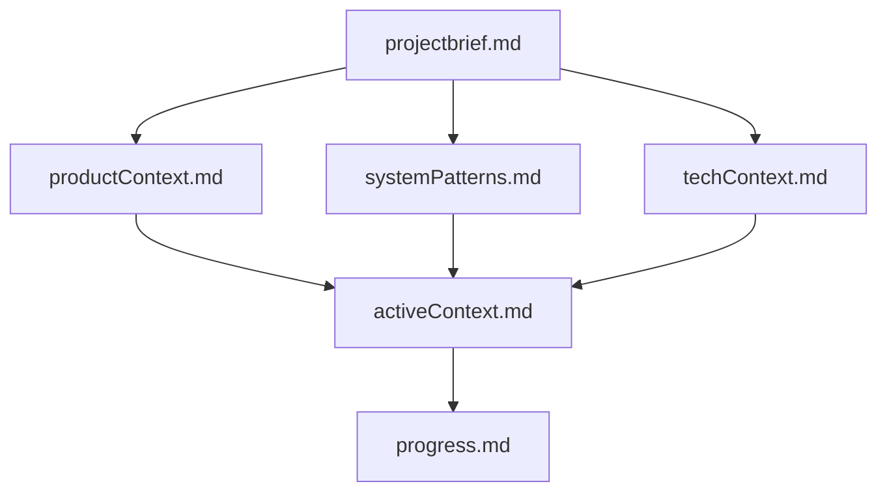

# Claude Code Memory Bank

[](http://unlicense.org/)

> A structured memory management system for Claude Code, adapted from Cline Memory Bank

## Overview

Claude Code Memory Bank is an experimental adaptation of the [Cline Memory Bank](https://docs.cline.bot/prompting/cline-memory-bank) methodology, specifically optimized for [Claude Code](https://claude.ai/code). It provides a systematic approach to maintaining project context across Claude Code sessions, enabling consistent and effective AI-assisted development.

### Why Claude Code Memory Bank?

When working with Claude Code, each new session starts with a fresh context. This system solves that limitation by:
- 📝 **Persistent Context**: Maintain project knowledge across sessions
- 🔄 **Consistent Development**: Experience predictable interactions with Claude
- 📚 **Self-Documenting**: Create valuable project documentation as a natural byproduct
- 🎯 **Structured Workflow**: Follow a proven methodology for AI-assisted development

## Features

- **Hierarchical Documentation Structure**: Organized memory files that build upon each other
- **Adaptive Initialization**: Smart `/init-memory-bank` command that detects existing project state
- **Custom Slash Commands**: Workflow commands tailored for Claude Code (`/workflow:understand`, `/workflow:plan`, etc.)
- **Claude Code Native**: Leverages `CLAUDE.md` and `@import` features  
- **Project Intelligence**: Auto-detects technologies, preserves existing documentation, and respects your work
- **Project Agnostic**: Works with any technology stack or project type
- **Version Control Friendly**: All memory files are plain markdown

## Table of Contents

- [Getting Started](#getting-started)
- [Installation](#installation)
- [Usage](#usage)
- [Project Structure](#project-structure)
- [How It Works](#how-it-works)
- [Custom Slash Commands](#custom-slash-commands)
- [Contributing](#contributing)
- [License](#license)
- [Credits](#credits)
- [Related Links](#related-links)

## Getting Started

### Prerequisites

- Claude Code (latest version recommended)
- A project where you want to implement memory management
- Basic understanding of markdown

### Installation

1. **Clone this repository** or download the files you need:
   ```bash
   git clone https://github.com/hudrazine/claude-code-memory-bank.git
   ```

2. **Copy the core files** to your project:
   ```bash
   # Copy the Memory Bank system documentation
   cp -r claude-code-memory-bank/.claude /path/to/your/project/
   ```

3. **Update your CLAUDE.md** to import the Memory Bank system:
   ```markdown
   # Your existing CLAUDE.md content...
   
   ## Additional Instructions
   - @.claude/claude-memory-bank.md
   ```

4. **Initialize your Memory Bank** using the custom command:
   ```
   > /init-memory-bank
   ```

## Usage

### Basic Workflow

1. **Start a new Claude Code session** in your project directory

2. **Use workflow commands** to maintain context:
   ```
   > /workflow:understand
   > /workflow:plan
   > /workflow:execute
   > /workflow:update-memory
   ```

3. **Memory Bank files** will be created in `memory-bank/` directory:
   - `projectbrief.md` - Core project overview
   - `productContext.md` - Product requirements and goals
   - `activeContext.md` - Current work focus
   - `systemPatterns.md` - Architecture and patterns
   - `techContext.md` - Technology stack details
   - `progress.md` - Development progress tracking

### Example Session

```bash
# First session - Initialize the project
> /init-memory-bank
# Claude analyzes your project and creates appropriate memory bank structure

# For a new project:
# - Creates all 6 core Memory Bank files
# - Asks for project details
# - Sets up initial structure

# For an existing project:
# - Auto-detects technologies from package.json, README, etc.
# - Preserves any existing Memory Bank files
# - Creates only missing files

# If you already have projectbrief.md:
# - Reads existing project brief
# - Uses it to populate other files automatically
# - Maintains consistency across all documentation

# Later session - Continue development
> /workflow:understand
# Claude reads memory bank and understands current state

> /workflow:plan Add user authentication
# Claude creates a plan based on existing context

> /workflow:execute
# Claude implements the feature

> /workflow:update-memory
# Claude updates the memory bank with new progress
```

## Project Structure

```
claude-code-memory-bank/
├── README.md                    # This file
├── LICENSE                      # Unlicense (public domain)
├── CLAUDE.md                    # Project instructions for Claude Code
├── references/                  # Reference documentation
│   ├── claude-code-manage-memory.md
│   ├── claude-code-slash-commands.md
│   └── cline-memory-bank.md
└── .claude/                     # Claude Code Memory Bank implementation
    ├── claude-memory-bank.md    # Core system documentation
    └── commands/                # Custom slash commands
        ├── init-memory-bank.md # Quick Memory Bank initialization
        ├── commit.md           # Git commit workflow
        └── workflow/           # Memory Bank workflows
            ├── understand.md   # Context analysis
            ├── plan.md        # Task planning
            ├── execute.md     # Task execution
            └── update-memory.md # Memory updates
```

### Key Files Explained

- **`.claude/claude-memory-bank.md`**: The core system documentation that defines how Memory Bank works
- **`.claude/commands/workflow/*.md`**: Custom slash commands implementing the Memory Bank workflow
- **`references/`**: Documentation about Claude Code features and the original Cline Memory Bank

## How It Works

### Memory Hierarchy

The Memory Bank uses a hierarchical structure where files build upon each other:



### Integration with Claude Code

1. **CLAUDE.md Import**: The system is loaded via `@import` in your CLAUDE.md
2. **Custom Commands**: Slash commands provide structured workflows
3. **Persistent Files**: Memory Bank files persist in your repository
4. **Version Control**: All changes are trackable through git

## Custom Slash Commands

### Workflow Commands

- `/workflow:understand` - Analyzes project context and current state
- `/workflow:plan` - Creates detailed implementation strategies
- `/workflow:execute` - Implements tasks with systematic approach
- `/workflow:update-memory` - Updates Memory Bank documentation

### Additional Commands

- `/init-memory-bank` - Initialize Memory Bank structure for new projects
- `/commit` - Structured git commit workflow

Commands can be customized by editing the files in `.claude/commands/`.

## Contributing

We welcome contributions! Here's how you can help:

1. **Fork the repository**
2. **Create a feature branch** (`git checkout -b feature/amazing-feature`)
3. **Commit your changes** (`git commit -m 'Add amazing feature'`)
4. **Push to the branch** (`git push origin feature/amazing-feature`)
5. **Open a Pull Request**

### Contribution Ideas

- Improve documentation
- Add new workflow commands
- Create examples for different project types
- Translate documentation
- Share your Memory Bank workflows

## License

This project is released into the public domain under the [Unlicense](http://unlicense.org/). You are free to use, modify, and distribute this software for any purpose.

## Credits

This project is an adaptation of the [Cline Memory Bank](https://docs.cline.bot/prompting/cline-memory-bank) methodology, originally developed for the Cline AI assistant. Special thanks to:

- The Cline team for creating the original Memory Bank concept
- The Cline Discord Community, particularly:
  - nickbaumann98
  - Krylo
  - snipermunyshotz

## Related Links

- [Claude Code Documentation](https://docs.anthropic.com/en/docs/claude-code)
- [Claude Code Memory Management](https://docs.anthropic.com/en/docs/claude-code/memory)
- [Claude Code Slash Commands](https://docs.anthropic.com/en/docs/claude-code/slash-commands)
- [Original Cline Memory Bank](https://docs.cline.bot/prompting/cline-memory-bank)
- [Cline Documentation](https://docs.cline.bot)

---

*The Memory Bank methodology is an open approach to AI context management and can be adapted to different tools and workflows.*
